<p align="center">
  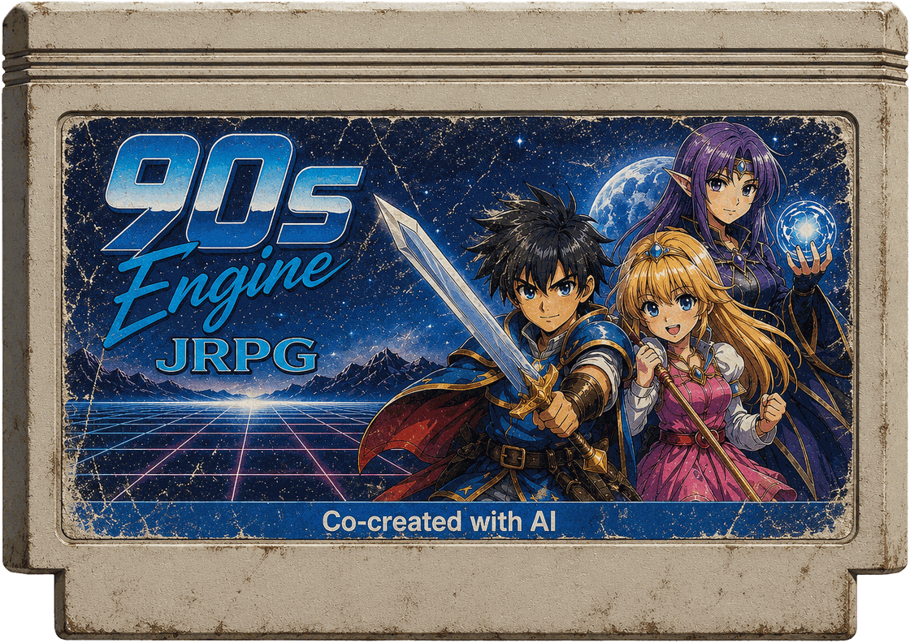
</p>

<h1 align="center">90s Engine</h1>

<p align="center">
  A local 2D engine for narrative JRPGs with SNES-era constraints,<br>
  built so a <b>human and an AI can author the same game at the same time</b>.
</p>

<p align="center">
  <a href="AUTHORING.md">Authoring guide</a> ·
  <a href="ORCHESTRATION.md">Co-authoring model</a> ·
  <a href="ARCHITECTURE.md">Architecture</a> ·
  <a href="#quick-start">Quick start</a>
</p>

<p align="center">
  
  
  
  
</p>

---

The human edits inside the running game with `F1`. The AI writes through MCP. Both go through
**one command session**, with one undo stack and one global validation — so neither can leave
the project broken, and neither can silently overwrite the other.

And while the JRPG is built, **its novel is built alongside it**. That is the Mirror Book: every
scene keeps a playable expression and a literary one, bound to the same canon, and the engine
tracks which of the two moved.

100% local. No network, no telemetry, no proprietary middleware, no audio or art files shipped —
music, sound and effects are synthesized from data at runtime.

<p align="center">
  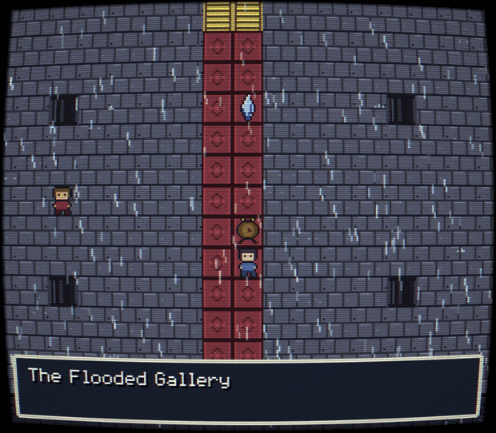
  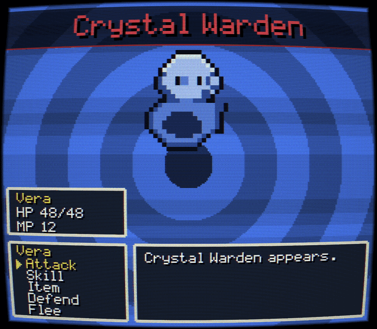
</p>
<p align="center">
  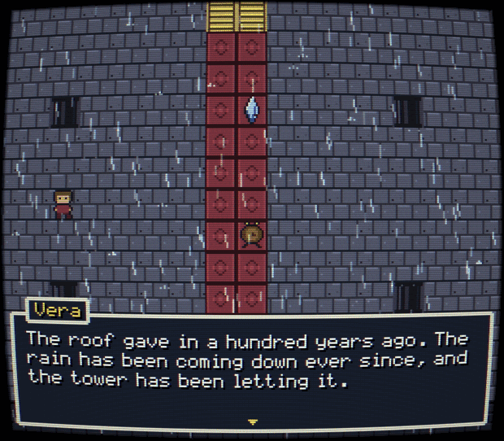
  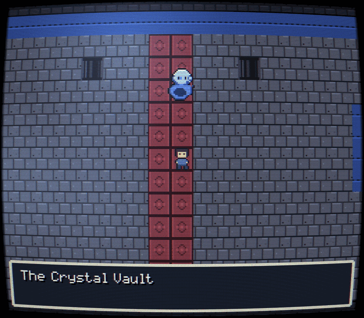
</p>
<p align="center">
  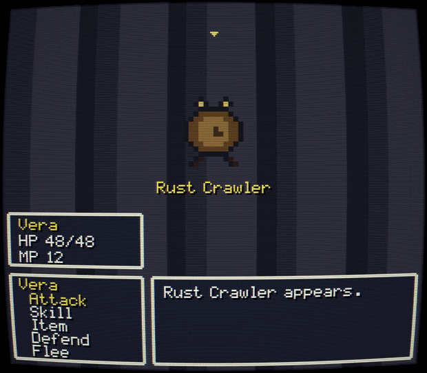
  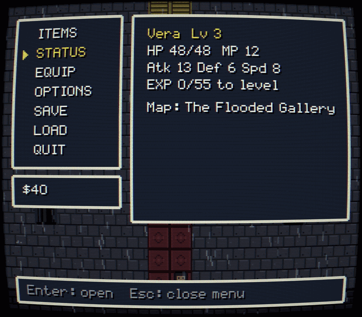
</p>
<p align="center">
  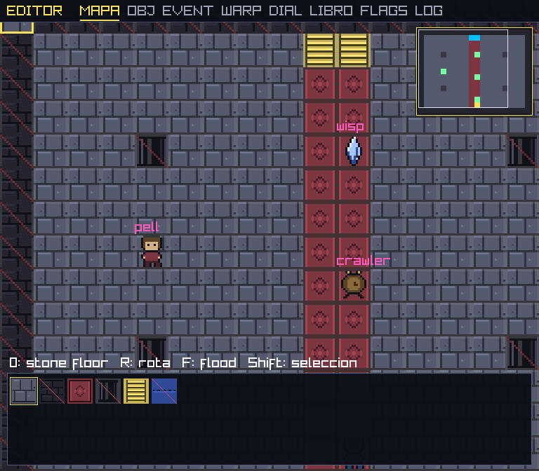
</p>

<p align="center"><sub>All of it is the bundled <b>90s Demo</b>, built entirely through MCP calls, shot through the engine's<br>
optional CRT filter (F2 turns it off). The editor is captured at native resolution, where its UI stays crisp.<br>
Every pixel is original: sprites are authored as data, the palette is hand-picked, and the music and sound are synthesized at runtime.</sub></p>

## Why it exists

JRPGs of the 90s separated engine from content: maps, text, enemies and events lived in tables
and banks, outside the main loop. That is why small teams shipped enormous games. What was bad
was the *encoding* — pointers, offsets, conventions no tool enforced — so a broken reference was
not a build error, it was something you found while playing, weeks later.

90s Engine keeps the separation and throws away the encoding. Content is readable JSON with
stable ids and **global validation on every write**. A call that would leave a dangling reference
does not leave a broken project behind; it rolls itself back and tells you how to fix it.

That guarantee is the whole reason it is safe to hand authoring to an AI.

---

## 1. Co-authoring: one command layer, two authors

Most tools that let an AI "help" with a game let the model write files. That works until the
model and the person work at the same time — two writers, one file, and whoever saves last wins.

Here there is exactly one way to change a project, and both authors are clients of it. The human
painting a tile with the mouse and the AI calling `map.paint_rect` are not two systems that need
reconciling. **They are the same call.**

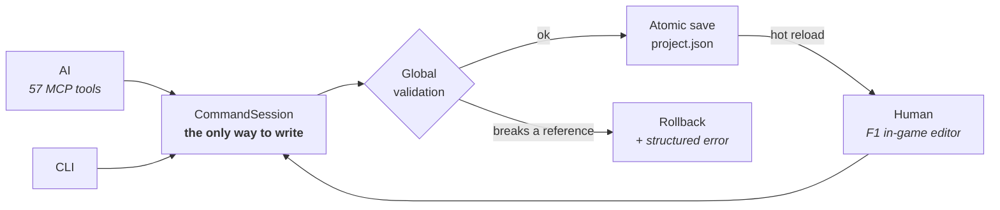

What that buys you:

| | |
|---|---|
| **One undo** | `Ctrl+Z` walks back through both authors' work in true chronological order |
| **Nobody overwrites anybody** | a monotonic `revision` counter; a stale session rebases onto the newer state instead of clobbering it |
| **Hot reload** | the AI writes, and the running game adopts the change live, keeping position, flags, party |
| **A shared log** | the editor's LOG tool shows one timeline: `[you]` for the human, `[ai]` for the AI |
| **No half-broken states** | every write is snapshot → apply → validate the *whole* project → save, or roll back |

Errors come back as data, never prose to be parsed:

```json
{ "code": "missing_vfx_anchor",
  "message": "event.gate anchors the vfx to event event.lantern.",
  "fix": "Create the event, or use '' / 'player' for the player." }
```

## 2. Orchestration: the AI can see, play and re-test its own work

An AI that cannot perceive its own output is guessing. Three tools close that loop:

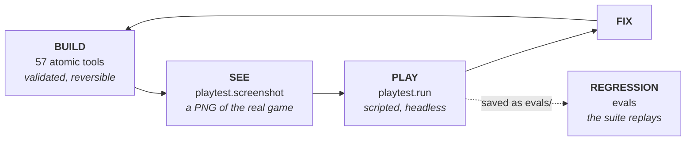

- **Build** — 57 atomic MCP tools. `batch.apply` runs many writes as one transaction (one
  validation, all-or-nothing, one undo); `batch.preview` shows the semantic diff first, touching
  neither disk nor history.
- **See** — `playtest.screenshot` renders any map, event, menu section, battle, editor tool, or a
  cutscene scrubbed to an exact step.
- **Play** — `playtest.run` walks a script (`move`, `interact`, `choose 1`, `auto`) with
  assertions on flags, map, items, money, party and level, and returns a step-by-step report.
- **Re-test** — save that script as `evals/<name>.txt` and it becomes regression. `evals` replays
  the whole suite and tells you when a change in chapter 3 quietly broke chapter 1.

None of it is a sample, because **there is no RNG anywhere in the engine**. Same script, same
result, on any machine. Verification is evidence.

The server also introduces itself: the MCP `initialize` response carries an instructions
briefing, so a connecting agent already knows to ask the author for premise, tone and core loop
before building anything, and knows the rules it must not break.

## 3. The Mirror Book: a game and a novel, born together

This is the part no other engine has. It is **not** a transcription of dialogue.

A playable scene and a literary scene pursue the same canon in different languages: the game
expresses through exploration, choice, combat, music and game feel; the novel expresses
interiority, rhythm, image and voice. A dialogue tree flattened into prose is not a chapter.

Each scene stores prose, synopsis, POV, place, time and editorial status, plus **links** to the
maps, events, dialogues and battles that express it in play. When you declare a scene reconciled,
`story.scene.sync` stores **two fingerprints** — one over the linked gameplay, one over the prose:

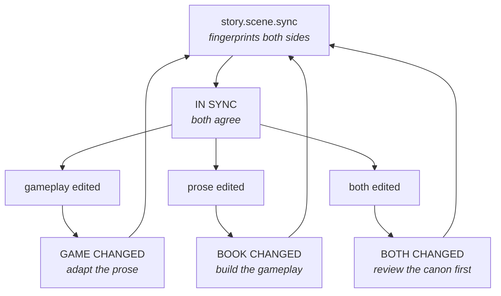

So the engine can always tell you *which side moved*. Adaptation runs in both directions and is
always an authorial act — free text is deliberately **never** compiled into gameplay by
heuristics. `story.import` deposits a manuscript as draft chapters and scenes with no links and
no inferred mechanics, because inferring gameplay from prose would create a second authoring
pipeline with its own truth, which is exactly what the single-command-layer design prevents.

The manuscript exports locally as Markdown with front matter and as an OpenXML `.docx` formatted
for editorial work: Times New Roman 12, double spaced, one-inch margins, title page, running
header, page numbers, chapter breaks. `--strict` refuses to export while a scene is out of sync.

**Every game made with this engine is a mirror game.** Both startup modes produce one:

```powershell
new --project MyGame                       # the story is born with the game
new --project MyGame --from manuscript.md  # an existing text becomes the canon
```

---

## Quick start

```powershell
dotnet build Seto90.sln

# Create a game. Two modes — an AI should ask the author which one before running this:
dotnet run --project Seto90 -- new --project MyGame                          # new story
dotnet run --project Seto90 -- new --project MyGame --from manuscript.md     # adapt a text

# Play / edit live (F1 = editor, F2 = CRT filter, Esc = pause menu)
dotnet run --project Seto90 -- run --project MyGame

# Verify
dotnet run --project Seto90 -- validate --project MyGame
dotnet run --project Seto90 -- evals --project MyGame                        # gameplay regression
dotnet run --project Seto90 -- quality-audit --project MyGame --run-playtests

# Export the parallel novel (Markdown + DOCX, all local)
dotnet run --project Seto90 -- export-book --project MyGame

# Publish (dist/ with a self-contained executable + game.pack)
dotnet run --project Seto90 -- publish --project MyGame
```

`new` writes a `project.json`, a `design.md` to fill in before building, an `AGENTS.md` for the
AI that opens the project, and a **`.mcp.json` already pointed at that project** — so an MCP
client picks up all 57 tools with no configuration:

```json
{
  "mcpServers": {
    "90s-engine": {
      "command": "<path>/Seto90.exe",
      "args": ["mcp", "--project", "<path>/MyGame"]
    }
  }
}
```

Try the bundled **90s Demo** with `dotnet run --project Seto90 -- run --project DemoGame`: two
floors of a flooded tower, rain, a merchant, two encounters and a boss, with the same scenes
written as prose in the Mirror Book. It was built entirely through MCP calls, including its
pixel art, its procedurally synthesized tile atlas and its music.

## Documentation

| | |
|---|---|
| [AUTHORING.md](AUTHORING.md) | Build a game: the full flow, all 57 MCP tools, event commands, audio/VFX/weather, evals, the quality cycle |
| [ORCHESTRATION.md](ORCHESTRATION.md) | How human and AI co-author safely: transactions, batches, the revision guard, hot reload, build→see→play |
| [ARCHITECTURE.md](ARCHITECTURE.md) | Technical design: stack, content model, retro constraints, the Mirror Book, the audits |

## What ships in the box

Tile maps with PNG atlases, animated tiles and warps with transitions (fade / iris / block
spiral) · events with conditioned pages, NPC routines and blocking cutscenes (directed movement,
camera pans, waits, emotes, key-item ceremony) · dialogues with choices, effects, pagination and
a typewriter · deterministic turn-based combat (party, MP skills, poison/sleep, defend, flee,
revive, equipment, EXP and levelling, real game over) · shops, inns and a persistent economy ·
multi-slot atomic saves with checksums · world time in narrative phases · declarative weather
(rain, snow, fog, lightning) · a chiptune tracker synth for music and SFX, with no audio files
anywhere · declarative code-generated VFX · procedural or PNG sprites · a hand-drawn 8x8 font ·
a 256x224 canvas with integer scaling and an optional CRT shader · an in-game editor on the same
command layer as the MCP, with hot reload and a co-authoring log · a bidirectional Mirror Book
with drift control and MD/DOCX export · scene, balance and quality audits that can gate packaging.

Every system has a headless deterministic smoke test, and every game can grow its own eval suite.

## Stack

C# / .NET 9 + [raylib-cs](https://github.com/ChrisDill/Raylib-cs) — one dependency. Content lives
in `project.json` during development and compiles to a single `game.pack` for distribution. Saves
go to `%LOCALAPPDATA%/Seto90/Saves/`.

> Public name: **90s Engine**. Internal code name: `Seto90` (namespace, CLI commands).
> The documentation, the engine UI and the bundled demo are in English; the CLI output and the
> code comments are in Spanish. `render.language` switches the engine UI (`en` / `es`).

## The golden rule

Do not turn 90s Engine into a general-purpose engine. Every new feature must justify why it
serves 90s JRPGs specifically, and how it is exposed to an AI over MCP with validation.

## License

MIT — see [LICENSE](LICENSE). Third-party attribution in [CREDITS.md](CREDITS.md). All art and
audio in this repository is original or procedurally generated.

---

<p align="center">
  Built by <b>SETO DEV</b> — <a href="https://seto.dev">seto.dev</a>
</p>
